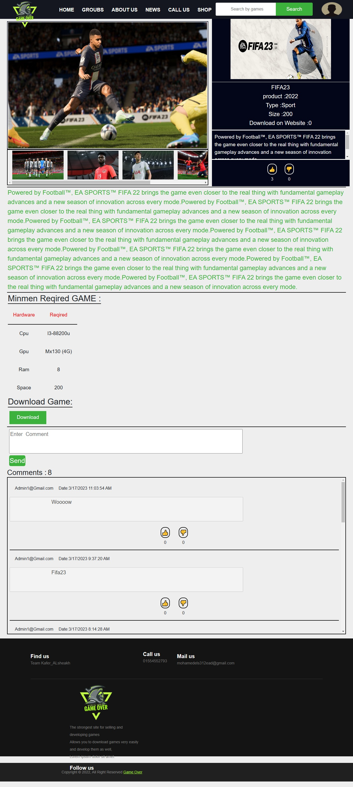

# GameOver

GameOver is a social media platform designed for gamers. It includes various features similar to popular social media sites like Facebook and YouTube, but tailored specifically for the gaming community.

## Features

1. **Add Friends Page**
   - A dedicated friends page that functions like a group page.
   - This page will display my friends and friends who have sent me requests.

2. **Add Posts Page**
   - A posts page similar to Facebook.
   - Users can share and view posts.

3. **Add Videos Page**
   - A videos page similar to YouTube.
   - Users can upload and view gaming videos.

4. **Friends Chat**
   - A chat feature allowing friends to communicate with each other.

5. **Group Search Page**
   - A search page within groups.
   - Displays pages the user is subscribed to and the ones they are considering joining.
##
**Index**

ImageProject/screencapture-localhost-7220-Home-Index-2023-04-03-03_31_32.png
**Gamge**

**Groubs**
.jpeg)
**Chat**

**Frinds**

**Account**

**Posts**

